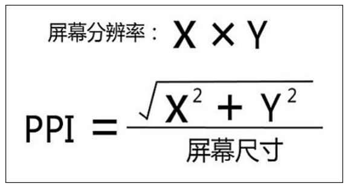

# 回答 CSS 面试题

## 1. 说说你对盒子模型的理解?

- 什么是盒模型

  - 当浏览器对一个文档进行布局时，浏览器会依据盒模型原则来对每一个元素进行渲染，将每一个元素渲染成为一个矩形盒子。
    这个矩形盒子会有四个属性，从内到外分别是 content、padding、border、margin。

  - content 表示的是实质内容。

  - padding 表示的是内填充。

  - border 表示的盒子的边框。

  - margin 表示的是盒子的外边距。

- 标准盒模型和 IE 盒模型：最主要的区别还是在 width 和 height 的含义上

  - 标准盒模型：width、height 代表的是 content 的宽高

  - IE 盒模型：width、height 代表的是 content + padding + border 的宽高

  - 这 2 类模型是可以使用一个 css 属性来切换的，那就是 box-sizing。

    - box-sizing: content-box; 代表的是标准盒模型

    - box-sizing: border-box; 代表的是 IE 盒模型

- 浏览器最终显示盒子的大小 = content + padding + border

  - 在标准盒模型中，width 代表的是 content 的宽度，那么要计算其在浏览器渲染后盒模型最终大小，还要加上盒模型的 padding 和 border；

  - 在 IE 盒模型中，width 代表的是 content + padding + border，所以 width 就是盒模型最终在浏览器渲染后显示的宽大小；

- margin 虽然是盒子模型的组成部分，但是和盒子的大小没有关系，margin 决定的事盒子占据的位置。

## 2. css 选择器有哪些？优先级？哪些属性可以继承？

- 基本选择器：

  - id 选择器：通过元素的 ID 属性选择 HTML 元素。ID 以 # 开头

  - 类选择器：通过类名选择 HTML 元素，类名以 . 开头

  - 标签选择器：通过标签名称选择 HTML 元素

  - 通配符选择器：通过 \* 匹配任何元素

- 组合（关系）选择器：

  - 后代选择器：选择某个元素的后代元素。使用空格分隔

  - 子元素选择器：选择某个元素的直接子元素。使用 > 分隔

  - 相邻兄弟选择器：选择某个元素后面紧邻的兄弟元素。使用 + 分隔

  - 通用兄弟选择器：选择某个元素之后的所有兄弟元素。使用 ~ 分隔

- 群组选择器：同时选中对应选择器的元素，使用 , 分隔

- 属性选择器：选择带有指定属性的元素。

- 伪类选择器：选择特定状态或位置的元素

- 伪元素选择器：选择一个元素的某个部分而不是元素自己。

- 优先级：内联样式 > id 选择器 > 类、伪类选择器、属性选择器 > 元素、伪元素选择器 > 后代、子代、兄弟选择器

- 可继承：

  - visibility 元素可见性

  - 字体系列：font-weight 粗细、font-size 大小、font-style 风格

  - 文本系列：text-indent 缩进、text-align 水平对齐、color 颜色、line-height 行高

- 不可继承

  - display

  - 文本属性：vertical-align、text-decoration

  - 盒子模型的属性：宽度、高度、内外边距、边框等

  - 背景属性：背景图片、颜色、位置等

  - 定位属性：浮动、清除浮动、定位 position 等

  - 生成内容属性：content、counter-reset、counter-increment

  - 轮廓样式属性：outline-style、outline-width、outline-color、outline

  - 页面样式属性：size、page-break-before、page-break-after

## 3. 说说 em/px/rem/vh/vw 区别?

- CSS 中的单位分为绝对长度单位、相对长度单位

  - 绝对长度单位：cm、mm、in、px、pt、pc

  - 相对长度单位：em、ex、ch、rem、vw、vh、vmin、vmax、%

- em：相对于当前对象内文本的字体尺寸；如当前对行内文本的字体尺寸未被人为设置，则相对于浏览器的默认字体尺寸（1em = 16px）

  - 为了简化 `font-size` 的换算，我们需要在 css 中的 body 选择器中声明 `font-size= 62.5%`，这就使 em 值变为 `16px*62.5% = 10px` 这样 `12px = 1.2em`, `10px = 1em`, 也就是说只需要将你的原来的 px 数值除以 10，然后换上 em 作为单位就行了

  - em 的值并不是固定的

  - em 会继承父级元素的字体大小

  - em 是相对长度单位。相对于当前对象内文本的字体尺寸。如当前对行内文本的字体尺寸未被人为设置，则相对于浏览器的默认字体尺寸

  - 任意浏览器的默认字体高都是 16px

- px：像素，绝对长度单位；px 的大小和元素的其他属性无关

- rem：相对的只是 HTML 根元素`font-size`的值

  - 如果想要简化`font-size`的转化，我们可以在根元素 html 中加入`font-size: 62.5%`，这样页面中`1rem=10px`、`1.2rem=12px`、`1.4rem=14px`、`1.6rem=16px`;使得视觉、使用、书写都得到了极大的帮助

  - rem 单位可谓集相对大小和绝对大小的优点于一身

  - 和 em 不同的是 rem 总是相对于根元素，而不像 em 一样使用级联的方式来计算尺寸

- vw：就是根据窗口的宽度，分成 100 等份，100vw 就表示满宽，50vw 就表示一半宽。（vw 始终是针对窗口的宽）,即视窗（viewport）的宽度，1vw 等于视窗宽度的 1%

- vh：就是根据窗口的高度，分成 100 等份，100vh 就表示满高，50vh 就表示一半高。（vw 始终是针对窗口的高），即视窗（viewport）的高度，1vh 等于视窗高度的 1%

- 窗口的情况：在桌面端，指的是浏览器的可视区域；移动端指的就是布局视口

- 像 vw、vh，比较容易混淆的一个单位是 %，不过百分比宽泛的讲是相对于父元素

  - 对于普通定位元素就是我们理解的父元素

  - 对于 position: absolute;的元素是相对于已定位的父元素

  - 对于 position: fixed;的元素是相对于 ViewPort（可视窗口）

## 4. 说说设备像素、css 像素、设备独立像素、dpr、ppi 之间的区别？

- css 像素：适用于 web 编程，在 CSS 中以 px 为后缀，是一个长度单位

  - px：一个相对单位，相对的是设备像素（device pixel）；一般情况，页面缩放比为 1，1 个 CSS 像素等于 1 个设备独立像素

  - CSS 像素又具有两个方面的相对性：

    - 在同一个设备上，每 1 个 CSS 像素所代表的设备像素是可以变化的（比如调整屏幕的分辨率）

    - 在不同的设备之间，每 1 个 CSS 像素所代表的设备像素是可以变化的（比如两个不同型号的手机）

  - px 会受到下面的因素的影响而变化：每英寸像素（PPI）、设备像素比（DPR）

- 设备像素：又称为物理像素；指设备能控制显示的最小物理单位，不一定是一个小正方形区块，也没有标准的宽高，只是用于显示丰富色彩的一个“点”而已，从屏幕在工厂生产出的那天起，它上面设备像素点就固定不变了，单位为 pt

- 设备独立像素：与设备无关的逻辑像素，代表可以通过程序控制使用的虚拟像素，是一个总体概念，包括了 CSS 像素；电脑屏幕的分辨率（非严谨说法）指的就是设备独立像素；一个设备独立像素里可能包含 1 个或者多个物理像素点，包含的越多则屏幕看起来越清晰

- dpr：（device pixel ratio），设备像素比，代表设备独立像素到设备像素的转换关系，在 JavaScript 中可以通过 window.devicePixelRatio 获取；设备像素比（DPR） = 设备像素 / 设备独立像素

  - 当设备像素比为 1:1 时，使用 1（1×1）个设备像素显示 1 个 CSS 像素

  - 当设备像素比为 2:1 时，使用 4（2×2）个设备像素显示 1 个 CSS 像素

  - 当设备像素比为 3:1 时，使用 9（3×3）个设备像素显示 1 个 CSS 像素

  - 当 dpr 为 3，那么 1px 的 CSS 像素宽度对应 3px 的物理像素的宽度，1px 的 CSS 像素高度对应 3px 的物理像素高度

- ppi：（pixel per inch），每英寸像素，表示每英寸所包含的像素点数目，更确切的说法应该是像素密度。数值越高，说明屏幕能以更高密度显示图像

## 5. css 中，有哪些方式可以隐藏页面元素？区别?

- 实现方式：

  - display:none

    - 设置元素的 display 为 none 是最常用的隐藏元素的方法；元素在页面上将彻底消失；元素本身占有的空间就会被其他元素占有，也就是说它会导致浏览器的重排和重绘消失后，自身绑定的事件不会触发，也不会有过渡效果

    - 特点：元素不可见，不占据空间，无法响应点击事件

- visibility:hidden

  - 从页面上仅仅是隐藏该元素，DOM 结果均会存在，只是当时在一个不可见的状态，不会触发重排，但是会触发重绘；给人的效果是隐藏了，所以他自身的事件不会触发

  - 特点：元素不可见，占据页面空间，无法响应点击事件

- opacity:0

  - opacity 属性表示元素的透明度，将元素的透明度设置为 0 后，在我们用户眼中，元素也是隐藏的

  - 不会引发重排，一般情况下也会引发重绘

  - 由于其仍然是存在于页面上的，所以他自身的的事件仍然是可以触发的，但被他遮挡的元素是不能触发其事件的；需要注意的是：其子元素不能设置 opacity 来达到显示的效果

  - 特点：改变元素透明度，元素不可见，占据页面空间，可以响应点击事件

- 设置 height、width 模型属性为 0

  - 将元素的 margin，border，padding，height 和 width 等影响元素盒模型的属性设置成 0，如果元素内有子元素或内容，还应该设置其 overflow:hidden 来隐藏其子元素

  - 特点：元素不可见，不占据页面空间，无法响应点击事件

- position:absolute

  - 将元素移出可视区域

  - 特点：元素不可见，不影响页面布局

- clip-path

  - 通过裁剪的形式

  - 特点：元素不可见，占据页面空间，无法响应点击事件

- 区别：

  | 区别                   | display: none | visibility: hidden | opacity: 0 |
  | ---------------------- | ------------- | ------------------ | ---------- |
  | 页面中                 | 不存在        | 存在               | 存在       |
  | 重绘                   | 会            | 会                 | 不一定     |
  | 重排                   | 会            | 不会               | 不会       |
  | 自身绑定事件           | 不触发        | 不触发             | 可触发     |
  | transition             | 不支持        | 支持               | 支持       |
  | 子元素可复原           | 不能          | 能                 | 能         |
  | 被遮挡的元素可触发事件 | 能            | 能                 | 不能       |
